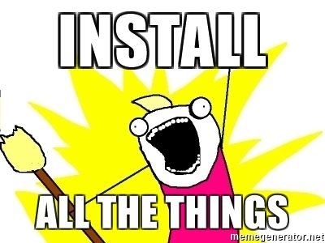

!SLIDE subsection

# Test Driven Infrastructure

!SLIDE

# what we are going to cover
- test driven development
- red, green, blue cycle
- composable DevOps toolchain
- infrastructure as code
- AWS infrastructure kata exercises

!SLIDE

# why are we doing this?


- Training is a force-multipler. One of us learns, we all can learn
- As a practice, it is important our skills and capabilities cutting edge
- Teaching a topic forces you to really know the material
- Presenting to a group is an important and professional skill

!SLIDE

## test driven development (TDD)


Test-Driven Development (TDD) is a popular software development process that involves writing tests and code in short, repeating development cycles with the goal to enforce good design and enhance confidence.

Benefits:

- Acceptance Criteria
- Focus
- Cleaner Code
- Safer Refactoring
- Fewer Bugs
- Test Automation

https://www.madetech.com/blog/9-benefits-of-test-driven-development

!SLIDE

## The Red, Green, Refactor Cycle


- Red: Write test that fails.
  - Understand the requirements and the state you want to implement. Implement the test, then run your entire test suite. The new test should fail.

- Green: Write code to make the test pass.
  - Implement just enough functionality to make the test pass. Don’t care much about readability, simplicity and design for now — just make it work. Run your tests again and watch all tests pass.

- Refactor: Make it pretty.
  -  Now that your tests pass, improve your implementation and make sure, by running your tests again, that you didn’t break anything.

devops.com: https://devops.com/agile-infrastructure-infrastructure-deserves-tests/

!SLIDE

## why infrastructure as code?


- provide a codified workflow to create infrastructure
- expose a workflow for managing updates to existing infrastructure
- integrate with application code workflows (Git, SCM, code review)
- provide modular, sharable components for separation of concerns
- distribution of knowledge, enables self-service (and vacations)
- test, build, test, deploy, run, verify

!SLIDE

## composable toolchain


- A set of specialized tools that can be chained together to form a larger process.
- We can compose a complete picture by selecting the best tool for each given task in a pipeline.
- Components can easily be updated or replaced as needed.
- Easy to adapt processes to changing requirements, without having to retool the entire process.
- Avoid vendor-lock when something better comes along.

!SLIDE

# tools
- [test-kitchen](https://docs.chef.io/kitchen.html)
- [terraform](https://www.terraform.io/)
- [awspec](https://github.com/k1LoW/awspec)

!SLIDE


# kitchen

`kitchen` is an easily extensible test harness that allows you to test your code written in Terraform, Ansible, Chef, Puppet (and others) on various cloud providers, virtualization providers and operating systems with tests written in a variety of test frameworks.

- Drivers: AWS, Azure, Vagrant, Docker

- Platforms: Linux, Windows

- Provisioners: terraform, chef, puppet, ansible, saltstack

- Test Suites: awspec, inspec, rspec, cucumber,

Enables you to use multiple of these tools

!SLIDE

## terraform

- `terraform` is used to build, change, and version infrastructure
- the overall goal is to safety, efficiency and predictability
- uses a human readable language to improve interpretation of infrastructure config
- makes reusing and extending existing infrastructure easy
- unify the view of resources using infrastructure as code
- `terraform` is open source

!SLIDE

# awspec

- `awspec` is RSpec tests for your AWS resources
- open-source testing framework for infrastructure with a human-readable language for specifying compliance, security and other policy requirements of AWS infrastructure
- allows for a rich set of AWS specific testing
- you can integrate automated tests that check for adherence to requirements & policy into any stage of your deployment pipeline.

!SLIDE

## amazing!
**amazing**
  əˈmeɪzɪŋ/Submit

_adjective_
  causing great surprise or wonder; astonishing.


!SLIDE

# kata
_Code Kata is an attempt to bring this element of practice to software development. A kata is an exercise in karate where you repeat a form many, many times, making little improvements in each. The intent behind code kata is similar._

-- Dave Thomas Code Kata

!SLIDE

## install all the things!


- `brew install ruby`
- `brew install ruby-dev`
- `brew install terraform`
- `gem install bundler --pre`
- `gem install test-kitchen`
- `gem install awsecrets`
- `gem install awspec`

!SLIDE

## AWS Setup
- AWS credentials
  - retrieve your `AWS_ACCESS_KEY_ID` and `AWS_SECRET_ACCESS_KEY`

  - The default location is $HOME/.aws/credentials on Linux and OS X, or "%USERPROFILE%\.aws\credentials" for Windows users.  See http://docs.aws.amazon.com/sdk-for-java/v1/developer-guide/credentials.html

  ```markdown
  [default]
  aws_access_key_id={YOUR_ACCESS_KEY_ID}
  aws_secret_access_key={YOUR_SECRET_ACCESS_KEY}

  ```

- AMI: Update with AMI for your region
  - https://aws.amazon.com/amazon-linux-ami/

  `tf/variables.tf`

  ```markup  
    variable "ami" {
      default = "ami-ed100689"
    }
  ```

!SLIDE

## terraform config syntax: `general overview`

This is what `terraform's` domain-specific language looks like...

```markdown
variable "ami" {
  description = "the AMI to use"
  default = "ami-ed100689"
}
```

...which is quite a bit easier to navigate than JSON:

```json
variable = [{
  "ami": {
    "description": "the AMI to use",
    "default" : "ami-ed100689"
  }
}]
```

!SLIDE

## awspec syntax: `test cases`

- awspec is a AWS domain-specific language (DSL)
- enables the writing of test cases specific to AWS
- awspec objects map to AWS services and resources
- written in natural language
- connects via AWS API's to execute tests
- integrates with kitchen as a verifier

```json
describe s3_bucket('my-bucket') do
  it { should exist }
end
```

!SLIDE

## main commands
- bundle exec kitchen verify
- bundle exec kitchen converge
- bundle exec kitchen destroy

!SLIDE

## kitchen.yml
```markdown
driver:
  name: terraform
  directory: tf
  variables:
    access_key: <%= ENV['AWS_ACCESS_KEY_ID'] %>
    secret_key: <%= ENV['AWS_SECRET_ACCESS_KEY'] %>

provisioner:
  name: terraform

platforms:
  - name: aws

verifier:
  name: awspec

suites:
  - name: default
    verifier:
      patterns:
      - spec/*_spec.rb
```

!SLIDE

## `bundle exec kitchen verify`
- run tests against AWS infrastructure
- reports success & fail and details

```markdown
$ bundle exec kitchen converge

vpc 'my-vpc'
  should exist
  cidr_block
    should eq "10.0.0.0/16"

security_group 'my-security-group'
  should exist
  inbound
    should be opened 8080

ec2 'my-ec2'
  should exist
  should have tag "Name"
  should have security group "my-security-group" (FAILED - 1)
  should belong to vpc "my-vpc" (FAILED - 2)
  instance_type
    should eq "t2.micro"
```

!SLIDE

## `bundle exec kitchen converge`

- execute changes to reach the desired state
- parallelizes changes wherever possible
- handles and recovers from transient errors safely
- moves from a current state to target state (delta approach)
- updates existing resources when allowed
- recreates existing when updates are not allowed

!SLIDE

# exercises

- VPC
- VPC w/CIDR block
- Security Group
- EC2 with name, security group & vpc

!SLIDE

# exercise : Write Test: VPC with CIDR block

```markdown
spec/vpc_spec.rb:

describe vpc('my-vpc') do
  it { should exist }
  its(:cidr_block) { should eq '10.0.0.0/16' }
end
```

[awspec:vpc](https://github.com/k1LoW/awspec/blob/master/doc/resource_types.md#vpc)
!SLIDE

# exercise : Test Fails: VPC with CIDR block

```markdown

$ bundle exec kitchen verify

vpc 'my-vpc'
  should exist (FAILED - 1)
  cidr_block
    example at ./spec/vpc_spec.rb:5 (FAILED - 2)
```

!SLIDE

# exercise : Write Code: VPC with CIDR block

```markdown
resource "aws_vpc" "my-vpc" {
  cidr_block       = "10.0.0.0/16"

  tags {
    Name = "my-vpc"
  }
}

  > bundle exec kitchen converge

```
[terraform:aws_vpc](https://www.terraform.io/docs/providers/aws/d/vpc.html)

!SLIDE

# exercise : Test Passes: VPC with CIDR block

```markdown
  > bundle exec kitchen verify

vpc 'my-vpc'
  should exist
  cidr_block
    should eq "10.0.0.0/16"

Finished in 0.93456 seconds (files took 1.44 seconds to load)
2 examples, 0 failures
```

!SLIDE

# exercise 4: Create a security group for tcp port 8080

- test
  - security group

- test

!SLIDE
# exercise 4: Create a security group for tcp port 8080

- test
  - security group

  ```markdown
  describe security_group('my-security-group-name') do
    it { should exist }
    its(:inbound) { should be_opened(8080).protocol('tcp') }
  end
  ```
  - ec2:

  ```markdown
    it { should have_security_group('my-security-group-name') }
  ```

- terraform code

```markdown
resource "aws_security_group" "instance" {
  name = "my-security-group-name"
  ingress {
    from_port = 8080
    to_port = 8080
    protocol = "tcp"
    cidr_blocks = ["0.0.0.0/0"]
  }
}
```

!SLIDE

# exercise 5: Create an autoscaling-groups

- Test

- Code
```markdown
resource "aws_autoscaling_group" "example" {
  launch_configuration = "${aws_launch_configuration.example.id}"
  min_size = 2
  max_size = 10
  tag {
    key = "Name"
    value = "terraform-asg-example"
    propagate_at_launch = true
  }
}
```

- TBD

!SLIDE

# exercise 6

- TBD

!SLIDE

# exercise 7

- TBD
# exercise 1: Instance size 'micro'

*As a developer, I need my default instance size to be 'micro' so that we can minimize the cost of development machines*

!SLIDE

# exercise 1: Write failed test

Write test: `spec/ec2_spec.rb`

```markdown  
   its(:instance_type) { should eq 't2.micro' }
```

Test fails:

```markdown
bundle exec kitchen verify
ec2 'georgep-ec2'
  should exist
  instance_type
    should eq "t2.micro" (FAILED - 1)
```

!SLIDE

# exercise 1: Implement change and apply

Write code: `tf/main.tf`

```markdown  
   its(:instance_type) { should eq 't2.micro' }
```

Apply change:

```markdown
bundle exec kitchen converge

       aws_instance.server: Modifying... (ID: i-0e8bcc54b897da944)
         instance_type: "t2.large" => "t2.micro"

       Apply complete! Resources: 0 added, 1 changed, 0 destroyed.
```

!SLIDE

# exercise 1: Test Passes

Test passes:

```markdown
bundle exec kitchen verify
ec2 'georgep-ec2'
  should exist
  instance_type
    should eq "t2.micro"

Finished in 0.62976 seconds (files took 1.44 seconds to load)
2 examples, 0 failures
```

!SLIDE

# exercise 2: Tag instance with Name

- Write Test

```markdown
  it { should have_tag('Name').value('georgep-ec2') }
```

- Write Code

```markdown
tags {
  Name = "georgep-ec2"
}
```

!SLIDE

# exercise 2: Tag instance with Name

- Apply

```markdown
bundle exec kitchen converge
```

- Verify

```markdown
bundle exec kitchen converge
```

!SLIDE

## commands: `bundle exec kitchen destroy`

- destroys all running infrastructure
- does not touch infrastructure not managed by `terraform`

- note: `kitchen converge` can also remove parts of infrastructure (e.g. if you comment out your code)

!SLIDE

### Credentials - Option 1 - .aws/credentials
- The default location is $HOME/.aws/credentials on Linux and OS X, or "%USERPROFILE%\.aws\credentials" for Windows users.  See http://docs.aws.amazon.com/sdk-for-java/v1/developer-guide/credentials.html
- When you create an AWS credentials file using the aws configure command, it creates a file with the following format:

```markdown
[default]
aws_access_key_id={YOUR_ACCESS_KEY_ID}
aws_secret_access_key={YOUR_SECRET_ACCESS_KEY}

```

### Credentials Option 2 - direnv / .envars
- If you are using the [direnv](https://direnv.net/) utility, you should:
  * create a .envrc file (see .envrc.sample)
  * run `direnv allow` to set the environment variables

- TBD
