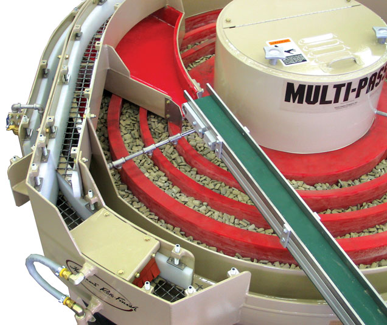

!SLIDE subsection

# awspec kitchen terraform

!SLIDE

# approach
- infrastructure as code
- composable toolchain
- test driven development
- red, green, blue
- three pass automation

!SLIDE

## why infrastructure as code

- provide a codified workflow to create infrastructure
- expose a workflow for managing updates to existing infrastructure
- integrate with application code workflows (Git, SCM, code review)
- provide modular, sharable components for separation of concerns
- distribution of knowledge, enables self-service (and vacations)
- build, deploy, run, verify

!SLIDE

## composable toolchain


- A set of specialized tools that can be chained together to form a larger process.
- We can compose a complete picture by selecting the best tool for each given task in a pipeline.
- Components can easily be updated or replaced as needed.
- Easy to adapt processes to changing requirements, without having to retool the entire process.
- Avoid vendor-lock when something better comes along.

!SLIDE


## test driven development (TDD)

Test-Driven Development (TDD) is a popular software development process that involves writing code in short, repeating development cycles with the goal to enforce good design and enhance confidence.


devops.com: https://devops.com/agile-infrastructure-infrastructure-deserves-tests/

!SLIDE

## The Red, Green, Refactor Cycle

- Red: Write test that fails.
  - Understand the requirements and the state you want to implement. Implement the test, then run your entire test suite. The new test should fail.

- Green: Write code to make the test pass.
  - Implement just enough functionality to make the test pass. Don’t care much about readability, simplicity and design for now — just make it work. Run your tests again and watch all tests pass.

- Refactor: Make it pretty.
  -  Now that your tests pass, improve your implementation and make sure, by running your tests again, that you didn’t break anything.

devops.com: https://devops.com/agile-infrastructure-infrastructure-deserves-tests/

!SLIDE


## Three-pass automation


- Pass 1: Do we know the steps?
  - Don't try to automate something you don't understand
- Pass 2: Can it even be automated?
  - Packaged software, monolithic packages, Pointy-clicky steps in the middle, undocumented, "Brent"
  - janky scripts are ok - If you aren't just a little embarrassed by your scripts you probably spent too much time
- Pass 3: Industrialised automation
  - Proper automation with tooling
  - Get things working fast, then refactor

!SLIDE

# tools
- test-kitchen
- terraform
- awspec

!SLIDE

## test kitchen

Test Kitchen is an easily extensible test harness that allows you to test your code written in Terraform, Ansible, Chef, Puppet (and others) on various cloud providers, virtualization providers and operating systems with tests written in a variety of test frameworks.

- Drivers: AWS, Azure, Vagrant, Docker

- Platforms: Linux, Windows

- Provisioners: terraform, chef, puppet, ansible, saltstack

- Test Suites: awspec, inspec, rspec, cucumber,

Enables you to use multiple of these tools

!SLIDE
## intro to terraform

- `terraform` is used to build, change, and version infrastructure
- the overall goal is to safety, efficiency and predictability
- uses a human readable language to improve interpretation of infrastructure config
- makes reusing and extending existing infrastructure easy
- all configuration is captured in code
- `terraform` is open source

!SLIDE

## why terraform (company goals)

- unify the view of resources using infrastructure as code
- support the modern data center (IaaS, PaaS, SaaS)
- expose a way to safely and predictably change infrastructure
- provide a workflow that is technology agnostic
- manage anything with an API


!SLIDE

## intro to awspec

- `awspec` is RSpec tests for your AWS resources
- the overall goal is to safety, efficiency and predictability
- uses a human readable language to improve interpretation of infrastructure config
- makes reusing and extending existing infrastructure easy
- all configuration is captured in code
- `awspec` is open source

!SLIDE

## why awspec

- TBD

!SLIDE


## amazing!
**amazing**
  əˈmeɪzɪŋ/Submit

_adjective_
  causing great surprise or wonder; astonishing.


!SLIDE

# kata
_Code Kata is an attempt to bring this element of practice to software development. A kata is an exercise in karate where you repeat a form many, many times, making little improvements in each. The intent behind code kata is similar._

-- Dave Thomas Code Kata

!SLIDE

## install all the things!


- `brew install ruby`
- `brew install ruby-dev`
- `brew install terraform`
- `gem install bundler --pre`
- `gem install test-kitchen`
- `gem install awsecrets`
- `gem install awspec`

!SLIDE
## AWS Setup
- AWS credentials
  - retrieve your `AWS_ACCESS_KEY_ID` and `AWS_SECRET_ACCESS_KEY`

- AMI: Update with AMI for your region
  - https://aws.amazon.com/amazon-linux-ami/

  `tf/variables.tf`

  ```markup  
    variable "ami" {
      default = "ami-ed100689"
    }
  ```

!SLIDE

## terraform config syntax: `general overview`

This is what `terraform's` domain-specific language looks like...

```markdown
variable "ami" {
  description = "the AMI to use"
}
```

...which is quite a bit easier to navigate than JSON:

```json
variable = [{
  "ami": {
    "description": "the AMI to use",
  }
}]
```

!SLIDE

## awspec syntax: `test cases`

!SLIDE

## main commands
- bundle exec kitchen converge
- bundle exec kitchen verify
- bundle exec kitchen destroy


!SLIDE

## commands: `bundle exec kitchen converge`

- execute changes to reach the desired state
- parallelizes changes wherever possible
- handles and recovers from transient errors safely
- moves from a current state to target state (delta approach)
  - updates existing resources when allowed
  - recreates existing when updates are not allowed

## commands: `bundle exec kitchen verify`


!SLIDE

# exercise 1: Instance size 'micro'

*As a developer, I need my default instance size to be 'micro' so that we can minimize the cost of development machines*

!SLIDE

# exercise 1: Write failed test

Write test: `spec/ec2_spec.rb`

```markdown  
   its(:instance_type) { should eq 't2.micro' }
```

Test fails:

```markdown
bundle exec kitchen verify
ec2 'georgep-ec2'
  should exist
  instance_type
    should eq "t2.micro" (FAILED - 1)
```

!SLIDE

# exercise 1: Implement change and apply

Write code: `tf/main.tf`

```markdown  
   its(:instance_type) { should eq 't2.micro' }
```

Apply change:

```markdown
bundle exec kitchen converge

       aws_instance.server: Modifying... (ID: i-0e8bcc54b897da944)
         instance_type: "t2.large" => "t2.micro"

       Apply complete! Resources: 0 added, 1 changed, 0 destroyed.
```

!SLIDE

# exercise 1: Test Passes

Test passes:

```markdown
bundle exec kitchen verify
ec2 'georgep-ec2'
  should exist
  instance_type
    should eq "t2.micro"

Finished in 0.62976 seconds (files took 1.44 seconds to load)
2 examples, 0 failures
```

!SLIDE

# exercise 2

- TBD
it { should have_tag('Name').value('georgep-ec2') }

!SLIDE

# exercise 3

- TBD

!SLIDE

# exercise 4

- TBD

!SLIDE

# exercise 5

- TBD

!SLIDE

# exercise 6

- TBD

!SLIDE

# exercise 7

- TBD

## commands: `bundle exec kitchen destroy`

- destroys all running infrastructure
- does not touch infrastructure not managed by `terraform`

- note: `kitchen converge` can also remove parts of infrastructure (e.g. if you comment out your code)

!SLIDE

### Credentials - Option 1 - .aws/credentials
- The default location is $HOME/.aws/credentials on Linux and OS X, or "%USERPROFILE%\.aws\credentials" for Windows users.  See http://docs.aws.amazon.com/sdk-for-java/v1/developer-guide/credentials.html
- When you create an AWS credentials file using the aws configure command, it creates a file with the following format:

```markdown
[default]
aws_access_key_id={YOUR_ACCESS_KEY_ID}
aws_secret_access_key={YOUR_SECRET_ACCESS_KEY}

[profile2]
aws_access_key_id={YOUR_ACCESS_KEY_ID}
aws_secret_access_key={YOUR_SECRET_ACCESS_KEY}
- each example has its own folder... please navigate into each folder to start the exercise

```

### Credentials Option 2 - direnv / .envars
- If you are using the [direnv](https://direnv.net/) utility, you should:
  * create a .envrc file (see .envrc.sample)
  * run `direnv allow` to set the environment variables

- TBD
