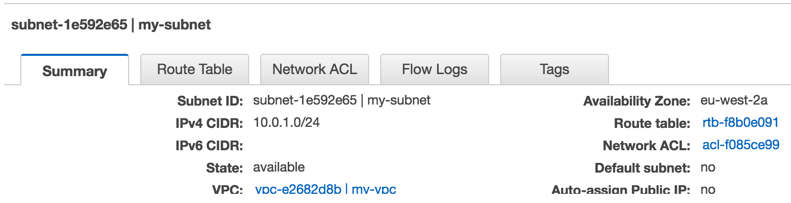
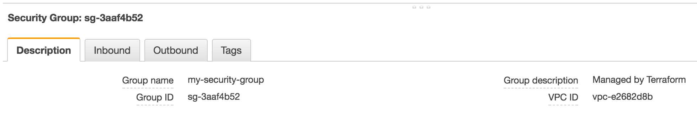
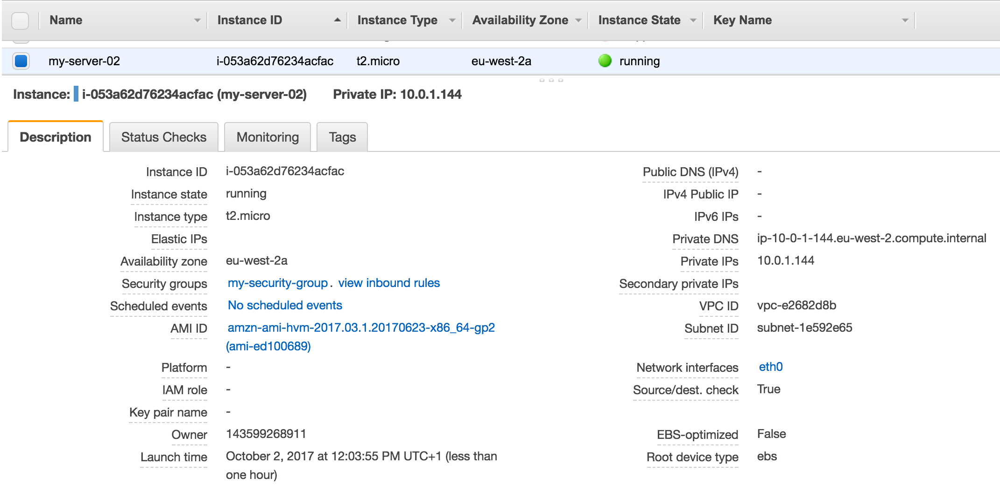

!SLIDE subsection

# Test Driven Infrastructure

!SLIDE

# what we are going to cover
- aspirations
- test driven development
- red, green, blue cycle
- composable DevOps toolchain
- infrastructure as code
- AWS infrastructure kata exercises

!SLIDE

# we aspire to...

Set the standard for delivering high-quality software

# we are *-driven

We are -driven

- test-
- pattern-
- behavior-
- cloud-
- security-

# we are T-shaped


- We have breadth and depth
- We are hungry learners
- We are strong collaborators

!SLIDE

## test driven development (TDD)


Test-Driven Development (TDD) is a software development practice of writing tests first, then write code in short, repeating cycles to encourage good design, enhance quality and confidence.

Benefits:

- Acceptance Criteria
- Focus
- Cleaner Code
- Safer Refactoring
- Fewer Bugs
- Test Automation

There is a lot of *talk* about TDD, but not as much actual practice

https://www.madetech.com/blog/9-benefits-of-test-driven-development

!SLIDE

## The Red, Green, Refactor Cycle


- Red: Write test that fails.
  - Understand the requirements and the state you want to implement. Implement the test, then run your entire test suite. The new test should fail.

- Green: Write code to make the test pass.
  - Implement just enough functionality to make the test pass. Don’t care much about readability, simplicity and design for now — just make it work. Run your tests again and watch all tests pass.

- Refactor: Make it pretty.
  -  Now that your tests pass, improve your implementation and make sure, by running your tests again, that you didn’t break anything.

devops.com: https://devops.com/agile-infrastructure-infrastructure-deserves-tests/

!SLIDE

## why infrastructure as code?


- better, faster, cheaper
- provides a codified workflow for creating & managing infrastructure
- integrate with application code workflows (Git, branch & merge, pair-programming, peer review)
- provide modular, sharable components for separation of concerns
- distribution of knowledge, enables self-service (and vacations), avoids 'shadow IT'
- test, build, test, deploy, run, verify

!SLIDE

## composable toolchain


- A set of specialized tools that can be chained together to form a larger process.
- We can compose a complete picture by selecting the best tool for each given task in a pipeline.
- Components can easily be updated or replaced as needed.
- Easy to adapt processes to changing requirements, without having to retool the entire process.
- Avoid vendor-lock when something better comes along.

!SLIDE

# tools
- [awspec](https://github.com/k1LoW/awspec)
- [terraform](https://www.terraform.io/)
- [kitchen](https://docs.chef.io/kitchen.html)

!SLIDE

# awspec

- `awspec` is RSpec tests for your AWS resources
- open-source testing framework for infrastructure with a human-readable language for specifying compliance, security and other policy requirements of AWS infrastructure
- allows for a rich set of AWS specific testing
- you can integrate automated tests that check for adherence to requirements & policy into any stage of your deployment pipeline.

!SLIDE

# kitchen

`kitchen` is an easily extensible test harness that allows you to test your code written in Terraform, Ansible, Chef, Puppet (and others) on various cloud providers, virtualization providers and operating systems with tests written in a variety of test frameworks.

- Drivers: AWS, Azure, Vagrant, Docker

- Platforms: Linux, Windows

- Provisioners: terraform, chef, puppet, ansible, saltstack

- Test Suites: awspec, inspec, rspec, cucumber,

Enables you to use multiple of these tools

!SLIDE

## terraform

- `terraform` is used to build, change, and version infrastructure
- the overall goal is to safety, efficiency and predictability
- uses a human readable language to improve interpretation of infrastructure config
- makes reusing and extending existing infrastructure easy
- unify the view of resources using infrastructure as code
- `terraform` is open source

!SLIDE


## amazing!
**amazing**
  əˈmeɪzɪŋ

_adjective_
  causing great surprise or wonder; astonishing.


!SLIDE

# kata


_Code Kata is an attempt to bring this element of practice to software development. A kata is an exercise in karate where you repeat a form many, many times, making little improvements in each. The intent behind code kata is similar._

-- Dave Thomas _Code Kata_

!SLIDE

## install all the things!


- `brew install ruby`
- `brew install ruby-dev`
- `brew install terraform`
- `gem install bundler --pre`
- `gem install test-kitchen`
- `gem install awsecrets`
- `gem install awspec`

!SLIDE

## AWS Setup
- AWS credentials
  - retrieve your `AWS_ACCESS_KEY_ID` and `AWS_SECRET_ACCESS_KEY`

  - The default location is $HOME/.aws/credentials on Linux and OS X, or "%USERPROFILE%\.aws\credentials" for Windows users.  See http://docs.aws.amazon.com/sdk-for-java/v1/developer-guide/credentials.html

  ```markdown
  [default]
  aws_access_key_id={YOUR_ACCESS_KEY_ID}
  aws_secret_access_key={YOUR_SECRET_ACCESS_KEY}

  ```

- AMI: Update with AMI for your region
  - https://aws.amazon.com/amazon-linux-ami/

  `tf/variables.tf`

  ```markup  
    variable "ami" {
      default = "ami-ed100689"
    }
  ```

!SLIDE


## awspec syntax: `test cases`

- awspec is a AWS domain-specific language (DSL)
- enables the writing of test cases specific to AWS
- awspec objects map to AWS services and resources
- written in natural language
- connects via AWS API's to execute tests
- integrates with kitchen as a verifier

```json
describe s3_bucket('my-bucket') do
  it { should exist }
end
```

!SLIDE

## terraform config syntax: `general overview`

This is what `terraform's` domain-specific language looks like...

```markdown
variable "ami" {
  description = "the AMI to use"
  default = "ami-ed100689"
}
```

...which is quite a bit easier to navigate than JSON:

```json
variable = [{
  "ami": {
    "description": "the AMI to use",
    "default" : "ami-ed100689"
  }
}]
```

!SLIDE

## kitchen config & commands
- kitchen.yml
- bundle exec kitchen verify
- bundle exec kitchen converge
- bundle exec kitchen destroy

!SLIDE

## kitchen.yml
```markdown
driver:
  name: terraform
  root_module_directory: tff

provisioner:
  name: terraform

platforms:
  - name: aws

verifier:
  name: awspec

suites:
  - name: default
    verifier:
      patterns:
      - spec/*_spec.rb
```

!SLIDE

## `bundle exec kitchen verify`
- run tests against AWS infrastructure
- reports success & fail and details

```markdown
$ bundle exec kitchen verify

vpc 'my-vpc'
  should exist
  cidr_block
    should eq "10.0.0.0/16"

security_group 'my-security-group'
  should exist
  inbound
    should be opened 8080

ec2 'my-ec2'
  should exist
  should have tag "Name"
  should have security group "my-security-group" (FAILED - 1)
  should belong to vpc "my-vpc" (FAILED - 2)
  instance_type
    should eq "t2.micro"
```

!SLIDE

## `bundle exec kitchen converge`

- execute changes to reach the desired state
- parallelizes changes wherever possible
- handles and recovers from transient errors safely
- moves from a current state to target state (delta approach)
- updates existing resources when allowed
- recreates existing when updates are not allowed
- calls `terraform apply` under the covers
- would be nice to have a `terraform plan` equivalent, which is not available yet.  so be careful...
- `terraform` bits are opaque, for example it not obvious where the tfstate files are kept and managed

!SLIDE

# exercises

- VPC
- Subnet
- Security Group
- EC2 with name, security group & vpc

!SLIDE

# exercise : vpc
Create a vpc with with CIDR block 10.0.1.0/16

!SLIDE
# exercise : vpc : write test

```markdown
spec/exercises_spec.rb:

describe vpc('my-vpc') do
  it { should exist }
  its(:cidr_block) { should eq '10.0.0.0/16' }
end
```

[awspec:vpc](https://github.com/k1LoW/awspec/blob/master/doc/resource_types.md#vpc)
!SLIDE

# exercise : vpc : test fails

```markdown

$ bundle exec kitchen verify

vpc 'my-vpc'
  should exist (FAILED - 1)
  cidr_block
    example at ./spec/exercises_spec.rb:6 (FAILED - 2)

Failed examples:

rspec ./spec/exercises_spec.rb:5 # vpc 'my-vpc' should exist
rspec ./spec/exercises_spec.rb:6 # vpc 'my-vpc' cidr_block
```

!SLIDE

# exercise : vcp : write code

```markdown
tf/main.tf:

resource "aws_vpc" "my-vpc" {
  cidr_block       = "10.0.0.0/16"

  tags {
    Name = "my-vpc"
  }
}

$ bundle exec kitchen converge
...
Apply complete! Resources: 1 added, 0 changed, 0 destroyed.
Finished converging <default-aws> (0m15.13s).
```

[terraform:aws_vpc](https://www.terraform.io/docs/providers/aws/d/vpc.html)


!SLIDE
# exercise : vpc : test passes

```markdown
$ bundle exec kitchen verify

vpc 'my-vpc'
  should exist
  cidr_block
    should eq "10.0.0.0/16"

Finished in 0.93456 seconds (files took 1.44 seconds to load)
2 examples, 0 failures
```

!SLIDE
# exercise : subnet
Create a subnet with a Name tag and CIDR block 10.0.1.0/24

!SLIDE
# exercise : subnet : write test

```markdown
describe subnet('my-subnet') do
  it { should exist }
  its(:cidr_block) { should eq '10.0.1.0/24' }
end
```

!SLIDE
# exercise : subnet test fails
```
$ bundle exec kitchen verify
vpc 'my-vpc'
  should exist
  cidr_block
    should eq "10.0.0.0/16"

subnet 'my-subnet'
  should exist (FAILED - 1)
  cidr_block
    example at ./spec/exercises_spec.rb:11 (FAILED - 2)

Finished in 0.96648 seconds (files took 1.39 seconds to load)
4 examples, 2 failures
```

!SLIDE
# exercise : subnet write code

```markdown
tf/main.tf

resource "aws_subnet" "my-subnet" {
  vpc_id     = "${aws_vpc.my-vpc.id}"
  cidr_block = "10.0.1.0/24"

  tags {
    Name = "my-subnet"
  }
}

```

```markdown
$ bundle exec kitchen converge
...
aws_vpc.vpc: Refreshing state... (ID: vpc-b2b5cddb)
aws_subnet.subnet: Creating...
  assign_ipv6_address_on_creation: "" => "false"
  availability_zone:               "" => "<computed>"
  cidr_block:                      "" => "10.0.1.0/24"
  ipv6_cidr_block:                 "" => "<computed>"
  ipv6_cidr_block_association_id:  "" => "<computed>"
  map_public_ip_on_launch:         "" => "false"
  tags.%:                          "" => "1"
  tags.Name:                       "" => "my-subnet"
  vpc_id:                          "" => "vpc-b2b5cddb"
aws_subnet.subnet: Creation complete after 5s (ID: subnet-e9c7b392)

Apply complete! Resources: 1 added, 0 changed, 0 destroyed.
```

!SLIDE
# exercise : subnet : test passes

```markdown
vpc 'my-vpc'
  should exist
  cidr_block
    should eq "10.0.0.0/16"

subnet 'my-subnet'
  should exist
  cidr_block
    should eq "10.0.1.0/24"

Finished in 2.51 seconds (files took 1.39 seconds to load)
4 examples, 0 failures

       Finished verifying <default-aws> (0m5.65s).
-----> Kitchen is finished. (0m5.99s)
```


!SLIDE
## exercise : security group : requirements
- Create a security group with Name tag
- Add ingress rules for tcp port 8080
- Associate security group with vpc

[awspec:security_group](https://github.com/k1LoW/awspec/blob/master/doc/resource_types.md#security_group)

[awspec:its](https://github.com/k1LoW/awspec/blob/master/doc/resource_types.md#itsinbound-itsoutbound)

[terraform:aws_security_group](https://www.terraform.io/docs/providers/aws/d/security_group.html)

!SLIDE
## exercise : security group : exists, Name tag : write test

```markdown
describe security_group('my-security-group') do
  it { should exist }
  it { should have_tag('Name').value('my-security-group') }
end
```

!SLIDE
## exercise : security group : exists, Name tag : test fails

```
$ bundle exec kitchen verify
vpc 'my-vpc'
  should exist
  cidr_block
    should eq "10.0.0.0/16"

subnet 'my-subnet'
  should exist
  cidr_block
    should eq "10.0.1.0/24"

security_group 'my-security-group'
  should exist (FAILED - 1)
  should have tag "Name" (FAILED - 2)

Failed examples:

rspec ./spec/exercises_spec.rb:16 # security_group 'my-security-group' should exist
rspec ./spec/exercises_spec.rb:17 # security_group 'my-security-group' should have tag "Name"
```

!SLIDE
## exercise : security group : exists, Name tag : write code

```
tf/main.tf

resource "aws_security_group" "my-security-group" {
  name = "my-security-group"

  tags {
    Name = "my-security-group"
  }
}
```

```
$ bundle exec kitchen converge
...

aws_security_group.my-security-group: Creating...
  description: "" => "Managed by Terraform"
  egress.#:    "" => "<computed>"
  ingress.#:   "" => "<computed>"
  name:        "" => "my-security-group"
  owner_id:    "" => "<computed>"
  tags.%:      "" => "1"
  tags.Name:   "" => "my-security-group"
  vpc_id:      "" => "<computed>"
aws_security_group.my-security-group: Creation complete after 0s (ID: sg-1747a27f)

Apply complete! Resources: 1 added, 0 changed, 0 destroyed.
```

!SLIDE
## exercise : security group : exists, Name : test passes

```
$ bundle exec kitchen verifying
...
security_group 'my-security-group'
  should exist
  should have tag "Name"

Finished in 0.50802 seconds (files took 1.35 seconds to load)
6 examples, 0 failures

       Finished verifying <default-aws> (0m3.65s).
-----> Kitchen is finished. (0m4.00s)
```

!SLIDE
## exercise : security group : ingress rules : write test

```
markdown
describe security_group('my-security-group') do
  it { should exist }
  it { should have_tag('Name').value('my-security-group') }
  its(:inbound) { should be_opened(8080).protocol('tcp') }
end
```

!SLIDE
## exercise : security group : ingress rules : test fails

```markdown
$ bundle exec kitchen verify
...

security_group 'my-security-group'
  should exist
  should have tag "Name"
  inbound
    should be opened 8080 (FAILED - 1)

Failed examples:

rspec ./spec/exercises_spec.rb:18 # security_group 'my-security-group' inbound should be opened 8080
```

!SLIDE
## exercise : security group : ingress rules: write code

```markdown
tf/main.tf

resource "aws_security_group" "my-security-group" {
  name = "my-security-group"

  tags {
    Name = "my-security-group"
  }

  ingress {
    from_port = 8080
    to_port = 8080
    protocol = "tcp"
    cidr_blocks = ["10.0.0.0/16"]
  }
}
```

```markdown
$ bundle exec kitchen converge
...

aws_security_group.my-security-group: Modifying... (ID: sg-1747a27f)
  ingress.#:                            "0" => "1"
  ingress.542945394.cidr_blocks.#:      "0" => "1"
  ingress.542945394.cidr_blocks.0:      "" => "10.0.0.0/16"
  ingress.542945394.from_port:          "" => "8080"
  ingress.542945394.ipv6_cidr_blocks.#: "0" => "0"
  ingress.542945394.protocol:           "" => "tcp"
  ingress.542945394.security_groups.#:  "0" => "0"
  ingress.542945394.self:               "" => "false"
  ingress.542945394.to_port:            "" => "8080"
aws_security_group.my-security-group: Modifications complete after 0s (ID: sg-1747a27f)

Apply complete! Resources: 0 added, 1 changed, 0 destroyed.
```

!SLIDE
## exercise : security group : ingress rules: test passes

```markdown
$ bundle exec kitchen verify
...

vpc 'my-vpc'
  should exist
  cidr_block
    should eq "10.0.0.0/16"

subnet 'my-subnet'
  should exist
  cidr_block
    should eq "10.0.1.0/24"

security_group 'my-security-group'
  should exist
  should have tag "Name"
  inbound
    should be opened 8080

Finished in 3.07 seconds (files took 1.39 seconds to load)
7 examples, 0 failures

       Finished verifying <default-aws> (0m6.25s).
-----> Kitchen is finished. (0m6.72s)
```

!SLIDE
## exercise : security group : vpc : write test

```markdown
describe security_group('my-security-group') do
  it { should exist }
  it { should have_tag('Name').value('my-security-group') }
  its(:inbound) { should be_opened(8080).protocol('tcp') }
  it { should belong_to_vpc('my-vpc') }
end
```

!SLIDE
## exercise : security group : vpc : test fails

```markdown
$ bundle exec kitchen verify
...
security_group 'my-security-group'
  should exist
  should have tag "Name"
  inbound
    should be opened 8080
  should belong to vpc "my-vpc" (FAILED - 1)

Failed examples:

rspec ./spec/exercises_spec.rb:19 # security_group 'my-security-group' should belong to vpc "my-vpc"
```
!SLIDE
## exercise : security group : vpc : write code

```
tf/main.tf

resource "aws_security_group" "my-security-group" {
  name = "my-security-group"

  tags {
    Name = "my-security-group"
  }

  ingress {
    from_port = 8080
    to_port = 8080
    protocol = "tcp"
    cidr_blocks = ["10.0.0.0/16"]
  }

  vpc_id = "${aws_vpc.vpc.id}"
}
```

```
$ bundle exec kitchen converge
...
aws_security_group.my-security-group: Creating...
  description:                          "" => "Managed by Terraform"
  egress.#:                             "" => "<computed>"
  ingress.#:                            "" => "1"
  ingress.542945394.cidr_blocks.#:      "" => "1"
  ingress.542945394.cidr_blocks.0:      "" => "10.0.0.0/16"
  ingress.542945394.from_port:          "" => "8080"
  ingress.542945394.ipv6_cidr_blocks.#: "" => "0"
  ingress.542945394.protocol:           "" => "tcp"
  ingress.542945394.security_groups.#:  "" => "0"
  ingress.542945394.self:               "" => "false"
  ingress.542945394.to_port:            "" => "8080"
  name:                                 "" => "my-security-group"
  owner_id:                             "" => "<computed>"
  tags.%:                               "" => "1"
  tags.Name:                            "" => "my-security-group"
  vpc_id:                               "" => "vpc-e2682d8b"
aws_security_group.my-security-group: Creation complete after 2s (ID: sg-3aaf4b52)
```

!SLIDE
## exercise : security group : vpc : test passes  

```markdown

$ bundle exec kitchen verify
...

vpc 'my-vpc'
  should exist
  cidr_block
    should eq "10.0.0.0/16"

subnet 'my-subnet'
  should exist
  cidr_block
    should eq "10.0.1.0/24"

security_group 'my-security-group'
  should exist
  should have tag "Name"
  should belong to vpc "my-vpc"
  inbound
    should be opened 8080

Finished in 1.2 seconds (files took 1.43 seconds to load)
8 examples, 0 failures

-----> Kitchen is finished. (0m4.96s)
```

!SLIDE
## exercise : ec2 instance : requirements

- exists
- is running
- using correct AMI
- is type t2.micro
- has a Name tag and set
- has security group
- belongs to vpc
- belong to subnet

[awspec:ec2](https://github.com/k1LoW/awspec/blob/master/doc/resource_types.md#ec2)

[terraform:instance](https://www.terraform.io/docs/providers/aws/d/instance.html)

!SLIDE
## exercise : ec2 instance : write test

```markdown
describe ec2(EC2Helper.GetIdFromName('my-server')) do
  it { should exist }
  it { should be_running }
  its(:image_id) { should eq 'ami-ed100689' }
  its(:instance_type) { should eq 't2.micro' }
  it { should have_tag('Name').value('my-server') }
  it { should have_security_group('my-security-group') }
  it { should belong_to_vpc('my-vpc') }
  it { should belong_to_subnet('my-subnet') }
end
```

!SLIDE
## exercise : ec2 : test fails

```markdown
$ bundle exec kitchen verify
ec2 'my-server'
  should exist (FAILED - 1)
  should be running (FAILED - 2)
  should have tag "Name" (FAILED - 3)
  should have security group "my-security-group" (FAILED - 4)
  should belong to vpc "my-vpc" (FAILED - 5)
  should belong to subnet "my-subnet" (FAILED - 6)
  image_id
    example at ./spec/exercises_spec.rb:25 (FAILED - 7)
  instance_type
    example at ./spec/exercises_spec.rb:26 (FAILED - 8)

Failed examples:

rspec ./spec/exercises_spec.rb:23 # ec2 'my-server' should exist
rspec ./spec/exercises_spec.rb:24 # ec2 'my-server' should be running
rspec ./spec/exercises_spec.rb:27 # ec2 'my-server' should have tag "Name"
rspec ./spec/exercises_spec.rb:28 # ec2 'my-server' should have security group "my-security-group"
rspec ./spec/exercises_spec.rb:29 # ec2 'my-server' should belong to vpc "my-vpc"
rspec ./spec/exercises_spec.rb:30 # ec2 'my-server' should belong to subnet "my-subnet"
rspec ./spec/exercises_spec.rb:25 # ec2 'my-server' image_id
rspec ./spec/exercises_spec.rb:26 # ec2 'my-server' instance_type

!SLIDE
## exercise : ec2 : write code

```markdown
resource "aws_instance" "server" {
  ami = "${var.ami}"
  instance_type = "t2.micro"

  tags {
    Name = "my-server"
  }

  security_groups = ["${aws_security_group.my-security-group.id}"]
  subnet_id = "${aws_subnet.subnet.id}"
}
```

```markdown
$ bundle exec kitchen converge
aws_instance.server: Creating...
  ami:                          "" => "ami-ed100689"
  associate_public_ip_address:  "" => "<computed>"
  availability_zone:            "" => "<computed>"
  ebs_block_device.#:           "" => "<computed>"
  ephemeral_block_device.#:     "" => "<computed>"
  instance_state:               "" => "<computed>"
  instance_type:                "" => "t2.micro"
  ipv6_address_count:           "" => "<computed>"
  ipv6_addresses.#:             "" => "<computed>"
  key_name:                     "" => "<computed>"
  network_interface.#:          "" => "<computed>"
  network_interface_id:         "" => "<computed>"
  placement_group:              "" => "<computed>"
  primary_network_interface_id: "" => "<computed>"
  private_dns:                  "" => "<computed>"
  private_ip:                   "" => "<computed>"
  public_dns:                   "" => "<computed>"
  public_ip:                    "" => "<computed>"
  root_block_device.#:          "" => "<computed>"
  security_groups.#:            "" => "1"
  security_groups.3781644720:   "" => "sg-3aaf4b52"
  source_dest_check:            "" => "true"
  subnet_id:                    "" => "subnet-1e592e65"
  tags.%:                       "" => "1"
  tags.Name:                    "" => "my-server-02"
  tenancy:                      "" => "<computed>"
  volume_tags.%:                "" => "<computed>"
  vpc_security_group_ids.#:     "" => "<computed>"
aws_instance.server: Still creating... (10s elapsed)
aws_instance.server: Still creating... (20s elapsed)
aws_instance.server: Creation complete after 26s (ID: i-053a62d76234acfac)

Apply complete! Resources: 1 added, 0 changed, 1 destroyed.
```

!SLIDE
## exercise : ec2 : tests pass

```markdown
$ bundle exec kitchen verify
...
ec2 'my-server-02'
  should exist
  should be running
  should have tag "Name"
  should have security group "my-security-group"
  should belong to vpc "my-vpc"
  should belong to subnet "my-subnet"
  image_id
    should eq "ami-ed100689"
  instance_type
    should eq "t2.micro"

Finished in 0.96834 seconds (files took 1.44 seconds to load)
```

!SLIDE
## Final tests
```markdown
require './spec/spec_helper'

describe vpc('my-vpc') do
  it { should exist }
  its(:cidr_block) { should eq '10.0.0.0/16' }
end

describe subnet('my-subnet') do
  it { should exist }
  its(:cidr_block) { should eq '10.0.1.0/24' }
end

describe security_group('my-security-group') do
  it { should exist }
  it { should have_tag('Name').value('my-security-group') }
  its(:inbound) { should be_opened(8080).protocol('tcp') }
  it { should belong_to_vpc('my-vpc') }
end

describe ec2('my-server-02') do
  it { should exist }
  it { should be_running }
  its(:image_id) { should eq 'ami-ed100689' }
  its(:instance_type) { should eq 't2.micro' }
  it { should have_tag('Name').value('my-server-02') }
  it { should have_security_group('my-security-group') }
  it { should belong_to_vpc('my-vpc') }
  it { should belong_to_subnet('my-subnet') }
end
```

!SLIDE
## Final Code


```markdown
tf/main.tf

provider "aws" {
  access_key = "${var.access_key}"
  secret_key = "${var.secret_key}"
  region = "${var.region}"
}

resource "aws_vpc" "vpc" {
  cidr_block       = "10.0.0.0/16"

  tags {
    Name = "my-vpc"
  }
}

resource "aws_subnet" "subnet" {
  vpc_id     = "${aws_vpc.vpc.id}"
  cidr_block = "10.0.1.0/24"

  tags {
    Name = "my-subnet"
  }
}

resource "aws_security_group" "my-security-group" {
  name = "my-security-group"

  tags {
    Name = "my-security-group"
  }

  ingress {
    from_port = 8080
    to_port = 8080
    protocol = "tcp"
    cidr_blocks = ["10.0.0.0/16"]
  }

  vpc_id = "${aws_vpc.vpc.id}"
}

resource "aws_instance" "server" {
  ami = "${var.ami}"
  instance_type = "t2.micro"

  tags {
    Name = "my-server-02"
  }

  security_groups = ["${aws_security_group.my-security-group.id}"]
  subnet_id = "${aws_subnet.subnet.id}"
}
```

!SLIDE
## AWS Console : vpc


!SLIDE
## AWS Console : subnet


!SLIDE
## AWS Console : security group



!SLIDE
## AWS Console : ec2 instance



!SLIDE
## Teardown & Cleanup


```markdown
$ bundle exec kitchen destroy

...
aws_vpc.vpc: Refreshing state... (ID: vpc-e2682d8b)
aws_subnet.subnet: Refreshing state... (ID: subnet-1e592e65)
aws_security_group.my-security-group: Refreshing state... (ID: sg-3aaf4b52)
aws_instance.server: Refreshing state... (ID: i-053a62d76234acfac)
aws_instance.server: Destroying... (ID: i-053a62d76234acfac)
aws_instance.server: Still destroying... (ID: i-053a62d76234acfac, 10s elapsed)
aws_instance.server: Still destroying... (ID: i-053a62d76234acfac, 20s elapsed)
aws_instance.server: Still destroying... (ID: i-053a62d76234acfac, 30s elapsed)
aws_instance.server: Still destroying... (ID: i-053a62d76234acfac, 40s elapsed)
aws_instance.server: Still destroying... (ID: i-053a62d76234acfac, 50s elapsed)
aws_instance.server: Destruction complete after 51s
aws_security_group.my-security-group: Destroying... (ID: sg-3aaf4b52)
aws_subnet.subnet: Destroying... (ID: subnet-1e592e65)
aws_subnet.subnet: Destruction complete after 1s
aws_security_group.my-security-group: Destruction complete after 1s
aws_vpc.vpc: Destroying... (ID: vpc-e2682d8b)
aws_vpc.vpc: Destruction complete after 0s

Destroy complete! Resources: 4 destroyed.
Finished destroying <default-aws> (1m37.10s).
-----> Kitchen is finished. (1m37.64s)
```

!SLIDE
## cleanup : all tests fail


this.did.not.do.what.i.expected

!SLIDE
## Console : EC2 terminated


_Pro Tip: destroyed / terminated instances will hang around for a bit (10 minutes?) before AWS cleans them up.  This can cause some issues with awspect if you spin resources back up immediately._

!SLIDE
# Questions / Discussion

!SLIDE
# Appendix

!SLIDE
### AWS Credentials - Option 1 - .aws/credentials
- The default location is $HOME/.aws/credentials on Linux and OS X, or "%USERPROFILE%\.aws\credentials" for Windows users.  See http://docs.aws.amazon.com/sdk-for-java/v1/developer-guide/credentials.html
- When you create an AWS credentials file using the aws configure command, it creates a file with the following format:

```markdown
[default]
aws_access_key_id={YOUR_ACCESS_KEY_ID}
aws_secret_access_key={YOUR_SECRET_ACCESS_KEY}

```

!SLIDE
### Credentials Option 2 - direnv / .envars
- If you are using the [direnv](https://direnv.net/) utility, you should:
  * create a .envrc file (see .envrc.sample)
  * run `direnv allow` to set the environment variables

```markdown
.envrc

export AWS_ACCESS_KEY_ID=[YOUR_AWS_ACCESS_KEY_ID]
export AWS_SECRET_ACCESS_KEY=[YOUR_AWS_SECRET_ACCESS_KEY]
export AWS_DEFAULT_REGION=eu-west-2  
```
